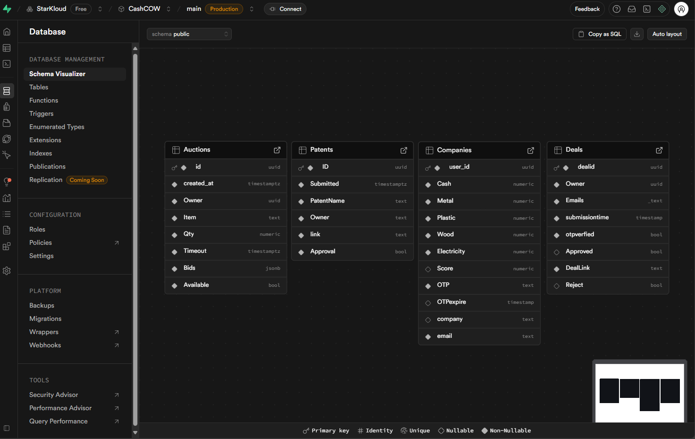

CashCow is a educational app that allows people to run programs to teach people about economics, business management, collaboration, and financial literacy. This application provides a plethora of features that can elevate the experience of your event, this includes:

1. Patenting
2. Auto Auction systems
3. Business deals with auto authentication
4. Overview for users logged into the system

This app is to be used with the CASHCOW event that is hosted.

## Installation

- clone the repository
- add supabase details in .env
- run index.js

### Database Structuring

1. Turn off RLS (Row level security for all tables)
2. Type the names and field as mentioned in the image
